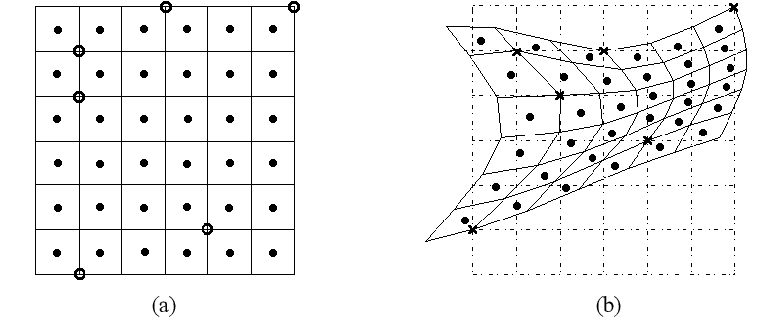
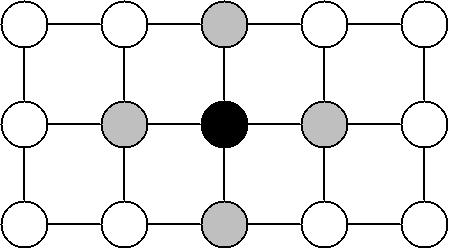

# Cell segmentation

This section describes the technical details behind Spateo's cell segmentation pipeline.


## Alignment of stain and RNA coordinates

* {py:func}`spateo.segmentation.refine_alignment`

Correct alignment between the stain and RNA coordinates is imperative to obtain correct cell segmentation. Slight misalignments can cause inaccuracies when aggregating UMIs in a patch of pixels into a single cell. We've found that for the most part, the alignments produced by the spatial assays themselves are quite good, but there are sometimes slight misalignments. Therefore, Spateo includes a couple of strategies to further refine this alignment to achieve the best possible cell segmentation results. In both cases, the stain image is considered as the "source" image (a.k.a. the image that will be transfomed), and the RNA coordinates represent the "target" image. This convention was chosen because the original RNA coordinates should be maintained as much as possible.


### Rigid alignment

The goal is to find the [affine transformation](https://en.wikipedia.org/wiki/Affine_transformation) of the stain such that the normalized cross-correlation (NCC) between the stain and RNA is minimized. Mathematically, we wish to find matrix $T$ such that

```{math}
:nowrap: true

$$\begin{bmatrix}
    x_{target}\\y_{target}\\1
\end{bmatrix} = T\begin{bmatrix}
    x_{source}\\y_{source}\\1
\end{bmatrix}$$
```

The matrix $T$ is optimized with [PyTorch](https://pytorch.org/)'s automatic differentiation capabilities. Internally, $T$ is represented as a $2 \times 3$ matrix, following PyTorch convention, and the [`affine_grid`](https://pytorch.org/docs/stable/generated/torch.nn.functional.affine_grid.html) and [`grid_sample`](https://pytorch.org/docs/stable/generated/torch.nn.functional.grid_sample.html) functions are used.


### Non-rigid alignment

The goal is to find a transformation from the source coordinates to the target coordinates (also minimizing the NCC as with [](#rigid-alignment)) where the transformation is defined using a set of reference ("control") points on the source image arranged in a grid (or a mesh) and displacements in each dimension (X and Y) from these points to a set of target points on the target image. Then, to obtain the transformation from the source to the target, the displacement of *every* source coordinate is computed by [thin-plate-spline](https://en.wikipedia.org/wiki/Thin_plate_spline) (TPS) interpolation. Here is an illustration of an image warped using control points and TPS interpolation [^ref1].



The displacements for each of the control points are also optimized using PyTorch. Internally, the [`thin_plate_spline`](https://kornia.readthedocs.io/en/latest/_modules/kornia/geometry/transform/thin_plate_spline.html) module in the [Kornia](https://kornia.github.io/) library is used for TPS calculations.


## Stain segmentation

**Segmentation functions**

* {py:func}`spateo.segmentation.mask_nuclei_from_stain`
* {py:func}`spateo.segmentation.mask_cells_from_stain`

**Labeling functions**

* {py:func}`spateo.segmentation.find_peaks`
* {py:func}`spateo.segmentation.find_peaks_from_mask`
* {py:func}`spateo.segmentation.find_peaks_with_erosion`
* {py:func}`spateo.segmentation.watershed`

**Deep learning functions**

* {py:func}`spateo.segmentation.stardist`
* {py:func}`spateo.segmentation.cellpose`
* {py:func}`spateo.segmentation.deepcell`


### Watershed-based segmentation

[Watershed](https://en.wikipedia.org/wiki/Watershed_(image_processing))-based nuclei segmentation works in three broad steps. First, a boolean mask, indicating where the nuclei are, is constructed (a.k.a. *segmentation*). Second, Watershed markers are obtained by iteratively eroding the mask. Finally, the Watershed algorithm is used to label each nuclei (a.k.a. *labeling*). We will go over each of these steps in more detail.


#### Segmentation

First, the boolean mask is obtained by a combination of global and local thresholding ({py:func}`spateo.segmentation.mask_nuclei_from_stain`). A [Multi-Otsu threshold](https://scikit-image.org/docs/dev/auto_examples/segmentation/plot_multiotsu.html) is obtained and the first class is classified as the "background" pixels. Then, [adaptive thresholding](https://docs.opencv.org/4.x/d7/d4d/tutorial_py_thresholding.html) (with a gaussian-weighted sum) is applied to identify nuclei. The downside of the adaptive ("local") thresholding approach is that regions with sparse nuclei tend to be very noisy. Therefore, the background mask is used to remove noise in background regions by taking the pixels that are `False` in the background mask (indicating foreground) and `True` in the local mask. The final mask is obtained by applying the [morphological](https://docs.opencv.org/3.4/d9/d61/tutorial_py_morphological_ops.html) closing and opening operations to fill in holes and remove noise.


#### Labeling

With the nuclei mask in hand, we need to identify initial markers in order to run the Watershed algorithm. Spateo offers a few different ways to obtain these markers. {py:func}`spateo.segmentation.find_peaks` can be used to find local peaks in the staining image and use those as the Watershed markers, or {py:func}`spateo.segmentation.find_peaks_from_mask` can be used to find markers from the nuclei mask itself by finding the peaks in the [distance transform](https://en.wikipedia.org/wiki/Distance_transform) ({py:func}`spateo.segmentation.find_peaks_with_erosion` approximates this process and may be faster in some cases).

Finally, the Watershed algorithm is applied on a blurred stain image, limiting the labels to within the mask obtained in the first step, using the initial markers from the previous step. This is done using the function {py:func}`spateo.segmentation.watershed`.


### Deep-learning-based segmentation

Spateo provides a variety of existing deep-learning-based segmentation models. These include:

* StarDist [^ref2]
* Cellpose [^ref3]
* Deepcell [^ref4]

In our experiments, StarDist performed the most consistently and is the recommended method to try first. We've also found that performing [Contrast Limited Adaptive Histogram Equalization](https://en.wikipedia.org/wiki/Adaptive_histogram_equalization#Contrast_Limited_AHE) (CLAHE) improves performance of these models, and is implemented with the `equalize` argument.


### Integrating both segmentation approaches

* {py:func}`spateo.segmentation.augment_labels`

The Watershed-based and deep learning-based segmentation approaches have their own advantages. The former tends to perform reasonably well on most staining images and does not require any kind of training. However, the resulting segmentation tends to be "choppy" and sometimes breaks convexity. The latter performs very well on images similar to those they were trained on and results in more evenly-shaped segmentations, but does poorly on outlier regions. In particular, we've found that the deep learning-based approaches have difficulty identifying nuclei in dense regions, often resulting in segmentations spanning multiple nuclei, or missing them entirely.

Therefore, we implemented a simple method of integrating the Watershed-based segmentation into the deep-learning-based segmentation. For every label in the Watershed segmentation that does not overlap with any label in the deep learning-based segmentation, the label is copied to the deep-learning-based segmentation, and for every label in the deep learning-based segmentation that does not overlap with any label in the Watershed-based segementation, the label is removed. This effectively results in "filling the gaps" ("augmenting") in the deep-learning segmentation using the Watershed segmentation, and removing noise amplified when applying CLAHE.


### Identifying cytoplasm

* {py:func}`spateo.segmentation.mask_cells_from_stain`

Taking advantage of the fact that most nuclei labeling strategies also very weakly label the cytoplasm, cytoplasmic regions can be identified by using a very lenient threshold. Then, cells can be labeled by iteratively expanding the nuclei labels by a certain distance.


## RNA segmentation

Spateo features several novel methods for cell segmentation using only RNA signal. As with any approximation/estimation method, some level of dropouts and noise is expected. A key requirement for RNA-only segmentation is that the unit of measure ("pixel") is much smaller than the expected size of a cell. Otherwise, there is no real benefit of attempting cell segmentation because each pixel most likely contains more than one cell.

**Segmentation functions**

* {py:func}`spateo.segmentation.score_and_mask_pixels`

**Labeling functions**

* {py:func}`spateo.segmentation.expand_labels`
* {py:func}`spateo.segmentation.find_peaks`
* {py:func}`spateo.segmentation.find_peaks_from_mask`
* {py:func}`spateo.segmentation.find_peaks_with_erosion`
* {py:func}`spateo.segmentation.label_connected_components`
* {py:func}`spateo.segmentation.watershed`

### Density binning

* {py:func}`spateo.segmentation.segment_densities`
* {py:func}`spateo.segmentation.merge_densities`

We've found in testing that the RNA-only segmentation method, without separating out regions with different RNA (UMI) densities, tends to be too lenient in RNA-dense regions and too strict in RNA-sparse regions. Therefore, unless the UMI counts are sufficiently sparse (such as the case when only certain genes are being used), we recommend to first separate out the pixels into different "bins" according to their RNA density. Then, RNA- only segmentation can be performed on each bin separately, resulting in a better-calibrated algorithm.

One important detail is that density binning, as with any kind of clustering, is highly subjective. We suggest testing various parameters to find one that qualitatively "makes sense" to you.

Spateo employs a spatially-constrained hierarchical Ward clustering approach to segment the tissue into different RNA densities. Each pixel (or bin, if binning is used) is considered as an observation of a single feature: the number of UMIs observed for that pixel. Spatial constraints are imposed by providing a connectivity matrix with an edge between each neighboring pixel (so each pixel has four neighbors).

There are a few additional considerations in this approach.

* As briefly noted in the previous paragraph, pixels can be grouped in the square bins (where the UMI count of each bin is simply the sum of UMIs of its constituent pixels). We highly recommend binning as it drastically reduces runtime with minimal downsides.
* The pixel UMI counts (or equivalently, the binned UMI counts) are Gaussian-blurred prior to clustering to reduce noise. The size of the kernel is controlled by the `k` parameter.
* After the pixels (or bins) have been clustered, each bin is "[dilated](https://docs.opencv.org/3.4/db/df6/tutorial_erosion_dilatation.html)" one at a time, in ascending order of mean UMI counts. The size of the kernel is controlled by the `dk` parameter. This is done to reduce sharp transitions between bins in downstream RNA-based cell segmentation that we've observed in our testing.


### Segmentation approaches

All approaches follow the following general steps.

1. Apply a 2D convolution (which may be Gaussian or summation) to the UMI count image. The size of the convolution is controlled with the `k` parameter.
2. Obtain per-pixel scores, usually in the range `[0, 1]`, indicating how likely each pixel is occupied by a cell.
3. Apply a threshold to these scores, which is either computed using [Otsu's method](https://en.wikipedia.org/wiki/Otsu%27s_method) or manually provided with the `threshold` parameter.
4. Apply [morphological](https://docs.opencv.org/4.x/d9/d61/tutorial_py_morphological_ops.html) opening and closing with size `mk` to fill in holes and remove noise. By default, this value is set to `k+2` when using the [Negative binomial mixture model](#negative-binomial-mixture-model-methods-including-em-or-vi), otherwise to `k-2`.

Each of the supported methods differ in how the per-pixel scores (step 2) are calculated.

#### Gaussian blur (`gauss`)

Apply Gaussian blur of the specified size, followed by `[0, 1]`-normalization to obtain per-pixel scores.

#### Moran's I (`moran`)

Apply Gaussian blur of the specified size, followed by computing the [Moran's I](https://en.wikipedia.org/wiki/Moran%27s_I) using a Gaussian kernel (the size of which is controlled by providing `k` to `moran_kwargs`.) Per-pixel scores are computed as the Moran's I value of each pixel, given that the p-value is less than `p_threshold` (default `0.05`). Pixels who's p-value is greater than or equal to this threshold are set to have a score of zero (indicating no spatial autocorrelation). This is the only method which may produce negative score values (indicating anticorrelation).

#### Negative binomial mixture model (methods including `EM` or `VI`)

The [negative binomial distribution](https://en.wikipedia.org/wiki/Negative_binomial_distribution) is widely used to model count data. It has been applied to many different kinds of biological data (such as sequencing data [^ref5]), and this is also how Spateo models the number of UMIs detected per pixel. For the purpose of cell segmentation, any pixel is either occupied or unoccupied by a cell. This is modeled as a two-component negative binomial mixture model, with one component for the UMIs detected in pixels occupied by a cell and the other for those unoccupied ("background"). Mathematically,

```{math}
:nowrap: true

$$P(X|p,r,r',\theta,\theta')=p \cdot NB(X|r,\theta)+(1-p) \cdot NB(X|r',\theta')$$
```
where
```{math}
:nowrap: true
\begin{align}
    X &\text{: number of observed UMIs}\\
    p &\text{: proportion of occupied pixels}\\
    NB(\cdot|r,\theta) &\text{: negative binomial PDF with parameters } r, \theta\\
    r,\theta &\text{: parameters to the negative binomial for occupied pixels}\\
    r',\theta' &\text{: parameters to the negative binomial for unoccupied pixels}
\end{align}
```

Ultimately, we wish to obtain estimates for $r,r',\theta,\theta'$. Spateo offers two strategies: expectation-maximization (EM) [^ref6] and a custom variational inference (VI) model. The latter is implemented with [Pyro](https://pyro.ai/), which is a Bayesian modeling and estimation framework built on top of PyTorch.

Once the desired parameter estimates are obtained, likelihoods of obtaining the number of observed UMIs $X$, for each pixel $(x,y)$, conditional on the pixel being occupied and unoccupied, are calculated.
```{math}
:nowrap: true

\begin{align}
    P_{(x,y)}(X|r,\theta) &\triangleq P_{(x,y)}(X|occupied)\\
    P_{(x,y)}(X|r',\theta') &\triangleq P_{(x,y)}(X|unoccupied)
\end{align}
```
Finally, using Bayes' theorem,
```{math}
:nowrap: true

$$P_{(x,y)}(occupied|X_{(x,y)}) = \frac{p \cdot P_{(x,y)}(X|r,\theta)}{P(X|p,r,r',\theta,\theta')}$$
```
which are used as the per-pixel scores.


#### Belief propgataion (methods including `BP`)

One important caveat of the [Negative binomial mixture model](#negative-binomial-mixture-model-methods-including-em-or-vi) is that it does *not* yield the marginal probabilities $P_{(x,y)}(occupied),P_{(x,y)}(unoccupied)$. In order to obtain these probabilities directly, Spateo can apply an efficient [belief propagation](https://en.wikipedia.org/wiki/Belief_propagation) algorithm. An undirected graphical model is constructed by considering each pixel as a node, and edges ("potentials") between neighboring pixels (a.k.a. a grid [Markov random field](https://en.wikipedia.org/wiki/Markov_random_field)).

 [^ref7]

Each pixel has two possible states: occupied or unoccupied. The conditional probabilities obtained with the [Negative binomial mixture model](#negative-binomial-mixture-model-methods-including-em-or-vi) are used as the node potentials, and the edge potentials are defined in such a way that it is more probable for two connected nodes have the same state. This encodes the expectation that if a pixel is occupied, then its neighbors are also likely to also be occupied (and vice-versa). Loopy belief propagation is run on this graph until convergence, which yields estimates for the desired marginal probabilities. The estimated marginal probability that each pixel is occupied, $\tilde{P}_{(x,y)}(occupied)$ is used as the per-pixel scores.


### Labeling approaches

A variety of labeling approaches can be used to identify individual cells from the RNA-based mask.

```{note}
In testing, we have found that the [](#watershed) labeling approach for RNA-based segmentation perform poorly when using total RNA. Therefore, we recommend only using this approach when using fairly sparse RNA, such as specific genes (i.e. nuclearly localized genes) or unspliced RNA.
```

#### Connected components

[Connected-component labeling](https://en.wikipedia.org/wiki/Connected-component_labeling) may be used to identify cell labels. Traditionally, connected-component labeling simply labels each connected "blob" of pixels as a single label. However, Spateo includes a modified version of this algorithm, {py:func}`spateo.segmentation.label_connected_components`, that provides various options to control its behavior. `area_threshold=np.inf` may be provided to perform traditional connected-component labeling. 

The key difference is the addition of an area-aware splitting procedure. Briefly, after obtaining initial labels via traditional connected-component labeling, we attempt to split components that are larger than `area_threshold` pixels (default `500`) by iteratively eroding these large components (this procedure will slowly "split" large connected components), while retaining components less than or equal to `min_area` (default `100`). Then, all large connected components have been split, these new, smaller components are dilated up to a distance of `distance`  (default `8`), up to a maximum area of `max_area` (default `400`).

Additionally, the `seed_layer` argument can be used to provide a set of "seed" labels. When this option is provided, any connected component that contains at least one seed label will not undergo the iterative erosion operation described in the previous paragraph. Instead, it will only undergo the iterative dilation operation using the seed labels as the initial components. This has the effect of labeling new components (using the modified connected-component labeling strategy described in the previous paragraph), while also retaining labels identified previously. This option is useful when transfering nuclei labels (obtained from nuclearly localized RNA and/or unspliced RNA) to cell labels (obtained from total RNA).


#### Watershed

An approach similar to that used to label cells in [Watershed-based segmentation](#watershed-based-segmentation) may also be used. {py:func}`spateo.segmentation.find_peaks` can be used to find local peaks in the RNA image and use those as the Watershed markers, or {py:func}`spateo.segmentation.find_peaks_from_mask` can be used to find markers from the RNA-based mask itself by finding the peaks in the [distance transform](https://en.wikipedia.org/wiki/Distance_transform) ({py:func}`spateo.segmentation.find_peaks_with_erosion` approximates this process and may be faster in some cases).

Finally, the Watershed algorithm is applied, limiting the labels to within the mask obtained in the first step, using the initial markers from the previous step. This is done using the function {py:func}`spateo.segmentation.watershed`. Either a blurred RNA image or the distance transform (if {py:func}`spateo.segmentation.find_peaks_from_mask` was used) may be used as the raw values for Watershed.

```{attention}
Some spatial assays may have artificial "patterns" on the spatial surface (a.k.a. chip). In particular, Stereo-seq chips contain horizontal and veritcal "tracklines" that are used to register the stain and RNA images, but also interferes with RNA capture. In such cases, using the RNA image directly as the Watershed values will result in discontinuities in the labels at these regions and is not recommended.
```

#### Expand labels

The {py:func}`spateo.segmentation.expand_labels` function with the `mask_layer` argument can also be used to obtain a labeling. This approach requires you to already have a set of initial labels (via one of the two previously labeling approaches) and is used to "expand" each of these labels by a certain distance `distance` (default `5`), up to a maximum area `max_area` (default `400`), while keeping the labels within the mask provided with `mask_layer`.


[^ref1]: Yin-Chiao Tsai, Hong-Dun Lin, Yu-Chang Hu, Chin-Lung Yu, Kang-Ping Lin (2006),
    *Thin-plate spline technique for medical image deformation*,
    [Journal of medical and biological engineering](https://www.airitilibrary.com/Publication/alDetailedMesh?docid=16090985-200012-20-4-203-210-a).
[^ref2]: Uwe Schmidt, Martin Weigert, Coleman Broaddus, Gene Myers (2018),
    *Cell Detection with Star-convex Polygons*,
    [International Conference on Medical Image Computing and Computer-Assisted Intervention (MICCAI)](https://arxiv.org/abs/1806.03535).
[^ref3]: Carsen Stringer, Tim Wang, Michalis Michaelos, Marius Pachitariu (2020),
    *Cellpose: a generalist algorithm for cellular segmentation*,
    [Nature Methods](https://doi.org/10.1038/s41592-020-01018-x).
[^ref4]: Noah F. Greenwald, Geneva Miller, Erick Moen, Alex Kong, Adam Kagel, Thomas Dougherty, Christine Camacho Fullaway, Brianna J. McIntosh, Ke Xuan Leow, Morgan Sarah Schwartz, Cole Pavelchek, Sunny Cui, Isabella Camplisson, Omer Bar-Tal, Jaiveer Singh, Mara Fong, Gautam Chaudhry, Zion Abraham, Jackson Moseley, Shiri Warshawsky, Erin Soon, Shirley Greenbaum, Tyler Risom, Travis Hollmann, Sean C. Bendall, Leeat Keren, William Graf, Michael Angelo, David Van Valen (2021),
    *Whole-cell segmentation of tissue images with human-level performance using large-scale data annotation and deep learning*,
    [Nature Biotechnology](https://doi.org/10.1038/s41587-021-01094-0).
[^ref5]: Valentine Svensson (2020),
    *Droplet scRNA-seq is not zero-inflated*,
    [Nature Biotechnology](https://doi.org/10.1038/s41587-019-0379-5).
[^ref6]: Chunmao Huang, Xingwang Liu, Tianyuan Yao, Xiaoqiang Wang (2019),
    *An efficient EM algorithm for the mixture of negative binomial models*,
    [Journal of Physics: Conference Series](https://doi.org/10.1088/1742-6596/1324/1/012093).
[^ref7]: Peter Orchard,
    *Markov Random Field Optimisation*,
    [https://homepages.inf.ed.ac.uk/rbf/CVonline/LOCAL_COPIES/AV0809/ORCHARD/](https://homepages.inf.ed.ac.uk/rbf/CVonline/LOCAL_COPIES/AV0809/ORCHARD/).
