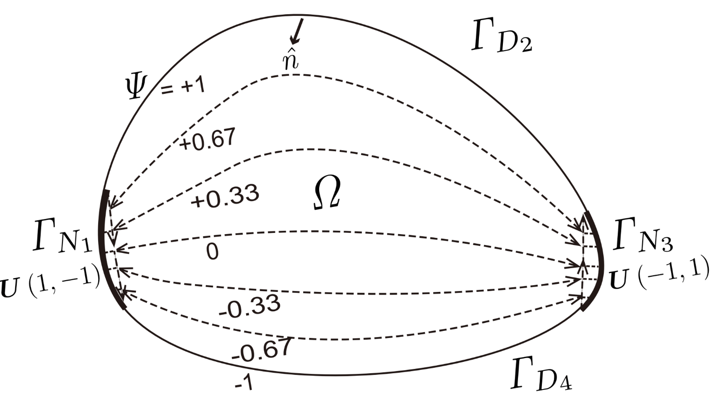
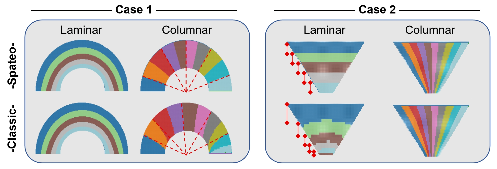

# Tissue geometry digitization

This section describes extra technical details behind Spateo's digitization module. For general method description, it's recommended to read the ‘spatial domain digitization’ chapter of method section in our paper.

Spateo’s digitization method aim to provide a relative spatial measurement, so that spatial variation of genes/cells along user arbitrary axis can be detected and quantified in a data-driven fashion. While Spateo acquires such spatial measurement by numerically solving the Laplace equation ($\triangledown ^{2}\psi = 0$) for the potential field problem (like described in the Spateo paper), it also innovatively optimizes the calculation of boundary conditions for the potential field, greatly enhancing robustness and generality across diverse biological scenarios.

The solution of the Laplace equation fully depends on the boundary conditions. Here, we use a two-dimensional potential field for illustration.

For any arbitrary shape of a domain $\Omega$, its periphery can be segmented into four connected boundaries ($ \Gamma_1 $, $ \Gamma_2 $, $ \Gamma_3 $, and $ \Gamma_4 $) with specified breakpoints. Such segmentation is particularly suitable for studying the spatial patterning along the anterior-posterior and dorsal-ventral axes in developmental embryos, as well as in tubular (e.g., aorta, gastrointestinal tract) or layered (e.g., cortex, skin) organs of adults. For clarity, we denote $ \Gamma_2 $ and $ \Gamma_4 $ as layer boundaries, and $ \Gamma_1 $ and $ \Gamma_3 $ as column boundaries.

In classical physics, the two layer boundaries are set as constant values (called [Dirichlet or class I boundary conditions](https://en.wikipedia.org/wiki/Dirichlet_boundary_condition)). In the Spateo algorithm, the layer boundary settings are identical; here, we numerically set $ \Gamma_2 = \Gamma{_D}{_2} = +1$ and $ \Gamma_4 = \Gamma{_D}{_4} = -1 $. The two column boundaries are specified by the normal derivative of the solution on the boundary (called [Neumann or class II boundary conditions](https://en.wikipedia.org/wiki/Neumann_boundary_condition)). This is formulated as $ \frac{\partial }{\partial \hat{\textbf{n}}}\psi(\textbf{r}) = 0,  \forall \textbf{r}\in \partial\Omega $ where n denotes the (typically exterior) normal to the data point r on boundary ∂Ω, which means the streamlines of the potential (the dashed lines with arrows in the schematic diagram) are perpendicular to $ \Gamma_1 $(i.e., $\Gamma{_N}{_1}$) and  $ \Gamma_3 $(i.e., $ \Gamma{_N}{_3} $).

In classical physics, column boundaries are usually assumed to be under ideal conditions to obtain analytical solutions by taking derivatives. However, in real biological cases, differentiability is not satisfied in most scenarios. Here we do simulations to see what will happen if we does not define the conditions of the column boundaries.

As shown, the calculation is exactly correct only when column boundaries $ \Gamma_1 $ and $ \Gamma_3 $  are straight line segments and perpendicular to layer boundaries $ \Gamma_2 $ and $ \Gamma_4 $ (as in layer digitization in Case 1). Otherwise, the solution deviates from a uniformed potential field (as in all other cases). Additionally, Spateo aims to solve the potential field in any arbitrary shape by redefining the column boundary conditions to a uniform distribution. Although this leads to a slight loss of precision, we successfully alter the Neumann boundary conditions to Dirichlet boundary conditions for boundaries $ \Gamma_1 $ and $ \Gamma_3 $, which allows us to directly assign and fix the values to each data point on the boundary rather than numerically calculating the derivatives for each point in every iteration.

As seen in the ‘spatial domain digitization’ chapter of method section in our paper, we set the boundary conditions as follows:

$$\psi_{\Gamma _{1}} = uniform(1, -1)$$

$$\psi_{\Gamma _{2}} = -1$$

$$\psi_{\Gamma _{3}} = uniform(-1, 1)$$

$$\psi_{\Gamma _{4}} = 1$$

and use the Jacobi method to iteratively solve the equations numerically.

